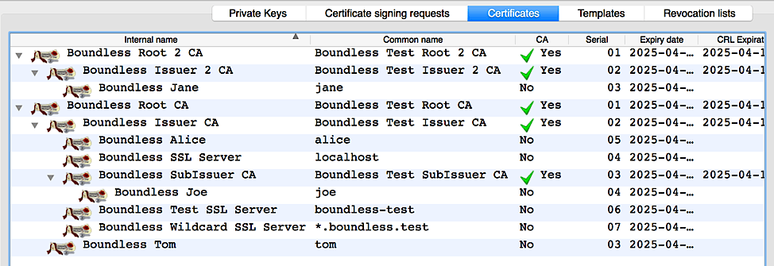

# Boundless Test Certificates/Keys

The certs/keys are generated/edited using **XCA** (see xca-project directory):

    https://sourceforge.net/projects/xca/

The Java keystore files are generated/edited using **KeyStore Explorer**:

    http://keystore-explorer.sourceforge.net/

The default password for the encrypted XCA project and Java keystore files is
**password**. The certificate signing structure can be reviewed in
`certs_hierarchy.png`.

**WARNING**: These components are just for testing and should _NOT_ be used
in a production environment.

*NOTE*: The `.[crt|pem]` choice for files (below) is because some applications
filter file open dialogs to specific extensions, e.g. pgAdmin3 always filters
`.crt` or `.key` and QGIS generally filters on `.pem`.

## Certificate Signing Hierarchy

## Client Certificates/Keys

* User certs: `[alice|tom|jane|joe]-cert.[crt|pem]`

* User keys:  `[alice|tom|jane|joe]-key.[key|pem]`

* Combined user certs/keys:  `[alice|tom|jane|joe].p12`

The default password for encrypted client keys is **password**.

## Client-side Certificate Authorities

* Root CA for all servers (below): `root-ca-cert.[crt|pem]`

The test root cert for all server certs is self-signed. You will need to have
this CA _trusted_ in your OS's or application's cert/key store or passed during
connections, so as to validate the cert of the connected server.

See **Client _hosts_ file configuration** below for configuring non-DNS host
resolution for the test server connections.

## Server Certificates/Keys

Three certificates are available for general SSL/TLS servers:

* `server-localhost-[cert|key].[crt|pem]` for **localhost** test servers
  accessed from the same host.

* `server-boundless-test-[cert|key].[crt|pem]` provides for a **boundless-test**
  domain, for testing non-localhost connections. All services are on one test
  machine.

* `server-wildcard-boundless-test-[cert|key].[crt|pem]` provides for
   **\*.boundless.test** domains, e.g. `whatever.boundless.test` or
  `boundless.test`, for testing non-localhost connections. Services are
  on different test machines, e.g. Docker containers.

The default password for encrypted server keys is **password**.

All are signed under the `issuer-root-ca-chain.[crt|pem]` certificate chain.

### Client _hosts_ file configuration

Domains of the non-localhost certificates can be associated locally for an IP
address of a remote test server or an (essentially remote) a VM or docker
container using the host OS's `hosts` file. This setup allows for testing where
a remote _localhost_ domain or and IP address will result in a 'hostname
mismatch' SSL error from clients.

Example entries in `hosts` file:

    <some-remote-or-virtual-machine-ip>    boundless-test
    <docker-container-on-linux-ip>         geoserver.boundless.test
    <another-docker-container-on-linux-ip> gwc.boundless.test
    <some-docker-machine-ip>               postgis.boundless.test

### Server-side client validation

When a server validates client certificates, some client certs maybe be signed
by the `Boundless Test Root 2 CA`, which is not the same as the root self-signed
CA for the server certificates (`Boundless Test Root CA`). This is similar to
enterprise PKI setups where client certs are signed by a different root CA than
the server.

Add the root and intermediate chains to the server's configuration, so that such
clients can be authenticated. (This setup is already pre-configured in the Java
keystore file.)

* Concatenated cert of all CA chains:
  `subissuer-issuer-root-ca_issuer-2-root-2-ca_chains.[crt|pem]`
